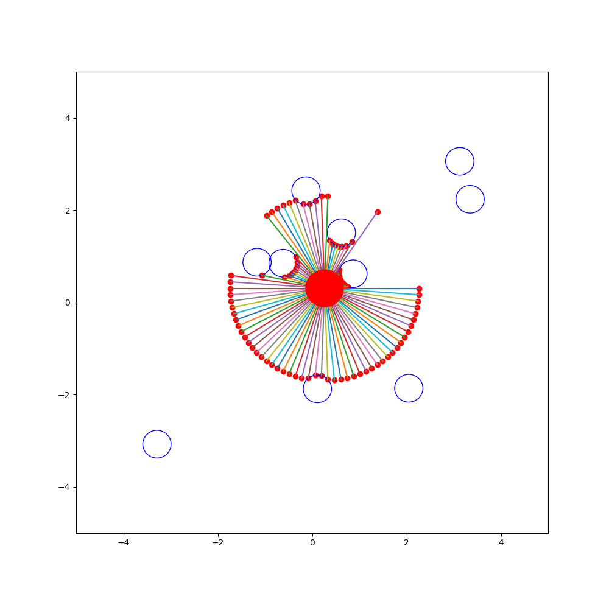

# 2D Robot and Lidar Simulation

*This is a simple simulation for a 2d robot and lidar.*

A simple 2D robot version with Lidar and deterministic sensor measurements for fast simulation. Environment simulation filled with circular obstacles. Made as a Python Package. Installation for easier usage stated below. 

## Installation

~~~
git clone https://github.com/EmanuelSamir/simple-2d-robot-lidar.git
cd simple-2d-robot-lidar
pip3 install -e .
~~~

## Usage

~~~python
from robot2d import Robot2D

robot = Robot2D()
print('Start process')
N = 10
vx = 2.
vy = -3

for i in range(N):
    robot.step(vx, vy)
    c = robot.is_crashed()
    if c:
        print('Crashed')
	robot.scanning()
	robot.render()
	time.sleep(robot.dT)
	print('step {}'.format(i))
robot.close()

robot.set_init_state(0.4, -3)
for i in range(N):
    robot.step(vx, vy)
    c = robot.is_crashed()
    if c:
        print('Crashed')
	robot.scanning()
	robot.render()
	time.sleep(robot.dT)
	print('step {}'.format(i))
robot.close()
    time.sleep(2)
~~~